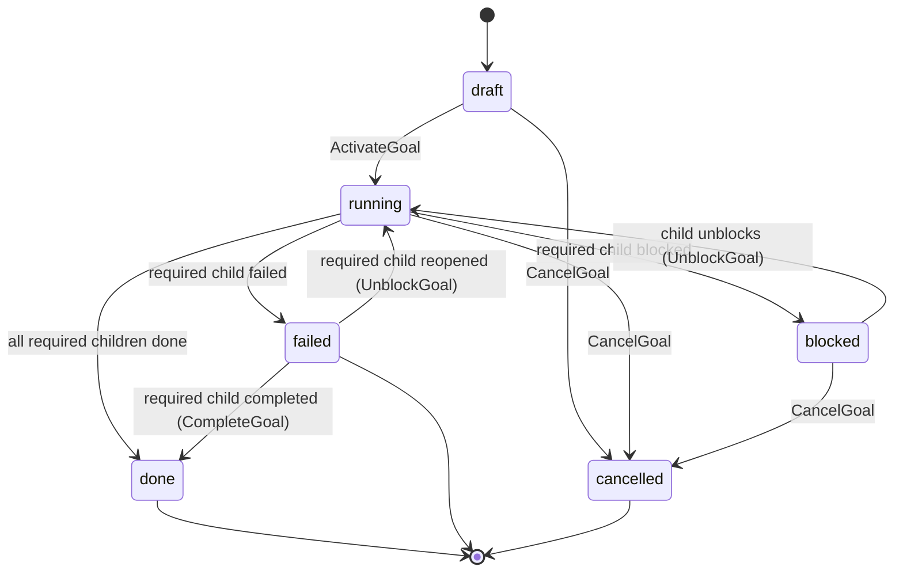

The supported goal system is a container layer on top of tasks. A **goal** owns child tasks and rolls up its status from those tasks.

It is not an automatic LLM planning system yet. Stella does not synthesize a final goal output or run agent reviewers for goal reviews. A goal's child tasks come only from a **materialized plan** (#525): author a plan, accept/approve it, and materialize it — you cannot hand-attach a task to a goal.

> Builds on the [Task system](./task-system).

## Current support matrix

| Feature                      | Status                                                    |
| ---------------------------- | --------------------------------------------------------- |
| Create/list/get goals        | Supported.                                                |
| Attach tasks to a goal       | Supported via `agent_task.goal_id`.                       |
| List child tasks             | Supported.                                                |
| Activate goal                | Supported: draft goal → running, draft children → ready.  |
| Rollup from child task state | Supported for `review_policy=none`.                       |
| Cancel goal                  | Supported: cascade-cancels non-terminal children.         |
| Automatic planner            | Not supported. Create child tasks explicitly.             |
| Final synthesizer            | Not supported. Do not rely on goal `review_policy!=none`. |
| Goal agent review            | Not supported.                                            |
| Agent reviewer runs          | Not supported.                                            |

## Mental model

| Concept                  | Purpose                                                                                                                                                           |
| ------------------------ | ----------------------------------------------------------------------------------------------------------------------------------------------------------------- |
| `agent_goal`             | Container for a related set of tasks. Stores required owner agent, optional project, status, priority, review policy, context, output, and active review pointer. |
| `agent_task.goal_id`     | Optional link from a task to one goal. Standalone tasks have no goal. Child tasks inherit/validate the goal's agent and project context.                          |
| `agent_task_run.goal_id` | Schema support for future goal-targeted planner/synthesizer runs. Dispatcher scan paths are removed in this release.                                              |
| `agent_review.goal_id`   | Schema support for future goal-parented reviews. API validation gates this off in this release.                                                                   |

## Supported lifecycle

Supported container mode:



Activation promotes draft child tasks to ready in the same transaction. The dispatcher then picks up those tasks through the normal task readiness path.

## Rollup

`internal/tasks/goal_rollup.go` exposes:

```go
RollupGoal(goal, childCounts, hasOpenSynth) GoalNextState
```

For supported `review_policy=none` goals:

| Child state                                  | Verdict                                                                                                                                 |
| -------------------------------------------- | --------------------------------------------------------------------------------------------------------------------------------------- |
| Any required child failed                    | Goal → `failed` with reason `required_child_failed`.                                                                                    |
| Any required child cancelled                 | Goal → `failed` with reason `required_child_cancelled` (a cancelled child cannot be reopened, so the requirement is permanently unmet). |
| Any required child blocked                   | Goal → `blocked` with reason `required_child_blocked`.                                                                                  |
| Any required child pending/running/reviewing | Goal → `running` (no-op for an already-running goal; recovers a `blocked` or `failed` goal).                                            |
| All required children done                   | Goal → `done`.                                                                                                                          |

A `blocked` or `failed` goal keeps rolling up, so it can recover: clearing a child blocker, or reopening/completing a failed required child, returns the goal to `running` via `UnblockGoal` (or straight to `done` via `CompleteGoal` when every required child is already done) on a later tick — there is no separate goal-unblock action. The dispatcher skips no-op transitions where the rolled-up target equals the current status, so a goal that stays failed produces no churn. A `cancelled` required child does not recover the goal: it re-asserts `failed`, since cancelled tasks cannot be reopened. A failed goal accepts no new child tasks — recovery is reopen-based, so reopen an existing failed child (which returns the goal to `running`) before attaching more work.

For `review_policy=auto`, `agent`, or `human`, the API rejects goal creation/activation in this release. Final synthesis and goal review require a future synthesizer runtime.

## Dispatcher behavior

The supported dispatcher goal behavior is rollup only. Within one tick:

1. Stale-run interruption and dependency-failure propagation run first.
2. `rollupGoals` evaluates active or recoverable goals (everything except `done`/`cancelled`) and applies goal complete/fail/block/unblock transitions when child task state requires it.
3. Worker task dispatch runs last, so a goal recovered to `running` in step 2 has its newly-ready children dispatched in the same tick.

Planner, synthesizer, and agent-reviewer dispatch scan paths are removed rather than left as noop failure paths. Unsupported goal modes are stopped at API validation.

## Child tasks come only from a materialized plan

A goal does not create child tasks by itself, and tasks cannot be hand-attached to a
goal (`POST /api/tasks` with a `goal_id` is rejected). The supported workflow is:

1. Create a goal. `plan_mode=direct` (default) seeds, accepts, and materializes a
   one-task plan automatically; `plan_mode=deferred` leaves it `draft` for step 2.
2. `PUT /api/goals/{id}/plan` — stage a structured `PlanContent` (items with
   `role` design/impl/verify, `deps`, `criteria`).
3. Accept it: `plan/accept` (`review_policy=none`), or `plan/submit-review` then a
   plan-review approve (`review_policy=human`).
4. `plan/materialize` — reconciles the plan into the child task graph; goal → `planned`.
5. Activate the goal; the worker runtime executes child tasks and rollup updates the goal.

This is deliberate: work always traces to an accepted plan. Automatic LLM planning
(returning structured items from a prompt) still requires a planner runtime and is
not wired yet — you author the plan content.

**What `direct` actually does (the default).** A direct goal is _not_ a "no plan"
shortcut — it still owns a real `agent_goal_plan` row. The system authors a
one-item plan (item titled after the goal, `role=direct`), accepts it without
review (`review_policy=none`), and materializes it in one step inside goal
creation. The single child task named after the goal **is** that plan's
materialization — not a hand-attached task. Choose `deferred` only when you want
to author a multi-step plan yourself. The plan is real and readable via
`GET /api/goals/{id}/plan`, and the goal detail page in the Web UI renders it as a
**Plan** section above the task graph (items with role, dependencies, and
criteria), so a direct goal's single-item plan is visible too.

## Review policy guidance

For now, use `review_policy=none` on goals.

Task-level reviews still work for supported policies:

- `none`
- `auto`
- `human`

Use human task reviews when child task output needs approval. Goal-level synthesis/review is rejected in this release and should not be presented as available.

## HTTP surface

| Method   | Path                                                                              | Purpose                                                                                                                                                                                                         |
| -------- | --------------------------------------------------------------------------------- | --------------------------------------------------------------------------------------------------------------------------------------------------------------------------------------------------------------- |
| `POST`   | `/api/goals`                                                                      | Create a goal. Use `review_policy=none` in the supported runtime. `plan_mode=direct` (default) auto-plans/materializes one task; `plan_mode=deferred` leaves it `draft` for explicit planning.                  |
| `GET`    | `/api/goals`                                                                      | List goals. Filters: `status`, `terminal` (true=done/failed/cancelled, false=active), `archived=true` (restore view), `q` (title/description substring). `total` in the response counts all matches for paging. |
| `GET`    | `/api/goals/{id}`                                                                 | Fetch one goal.                                                                                                                                                                                                 |
| `POST`   | `/api/goals/{id}/activate`                                                        | Draft → running; promotes draft children to ready.                                                                                                                                                              |
| `POST`   | `/api/goals/{id}/cancel`                                                          | Cascade-cancel non-terminal children.                                                                                                                                                                           |
| `DELETE` | `/api/goals/{id}`                                                                 | Archive a terminal/draft goal and its terminal/draft children (audit-safe; hides from default lists).                                                                                                           |
| `POST`   | `/api/goals/{id}/unarchive`                                                       | Restore an archived goal and the children that archive hid, back to default lists.                                                                                                                              |
| `GET`    | `/api/goals/{id}/tasks`                                                           | List child tasks.                                                                                                                                                                                               |
| `GET`    | `/api/goals/{id}/reviews`                                                         | Schema-supported, but this release gates the goal review runtime off through API validation.                                                                                                                    |
| `POST`   | `/api/goals/{id}/reviews/{reviewID}/approve` (+reject, request-changes, escalate) | Review decision endpoints exist, but this release does not create a new goal review runtime.                                                                                                                    |
| `GET`    | `/api/goals/{id}/plan`                                                            | Fetch the goal's plan (404 before the first `PUT`).                                                                                                                                                             |
| `PUT`    | `/api/goals/{id}/plan`                                                            | Create or replace the pending plan edit (`content` + `review_policy` none\|human). Refused while a plan review is open.                                                                                         |
| `POST`   | `/api/goals/{id}/plan/accept`                                                     | Accept the pending plan without review (`review_policy=none`). Does not promote — materialize does.                                                                                                             |
| `POST`   | `/api/goals/{id}/plan/submit-review`                                              | Open a human plan review (`review_policy=human`); returns the `subject='plan'` review.                                                                                                                          |
| `POST`   | `/api/goals/{id}/plan/reviews/{reviewID}/approve` (+reject, request-changes)      | Decide a plan review. Dedicated path — the generic goal-review API refuses `subject='plan'`.                                                                                                                    |
| `POST`   | `/api/goals/{id}/plan/materialize`                                                | Materialize an accepted/approved plan into the task graph; goal → `planned`.                                                                                                                                    |

Any change that rejects unsupported goal review policies must be done spec-first.

## Archiving and restore

Archiving is an audit-safe soft delete: `DELETE /api/goals/{id}` stamps `archived_at` and hides the goal (and its terminal/draft children) from default lists without deleting history. It is only allowed from a terminal or draft status, and is idempotent — re-archiving an already-archived goal is a no-op.

An archived goal is **inert**: every lifecycle transition (activate, complete, fail, cancel, block, unblock) and the dispatcher rollup scan reject or skip it, so hidden work is never silently revived. Unarchive first if you need to act on it again.

`POST /api/goals/{id}/unarchive` reverses the archive. It restores only the children that _this_ goal's archive cascade hid — recorded in the `goal_archive` event — so a task the user archived independently beforehand stays hidden. Restoring a non-archived goal is a no-op. Standalone tasks have the mirror surface: `DELETE /api/tasks/{id}` archives, `GET /api/tasks?archived=true` lists, `POST /api/tasks/{id}/unarchive` restores.

## Future work

Add these only after the worker runtime is stable:

- Planner runtime that returns structured child tasks and dependencies.
- Synthesizer runtime that produces final goal output from child task outputs.
- Goal-level review policy separate from synthesis policy, if needed.
- Agent reviewer runtime.
- Retry semantics for goal synthesis changes.
