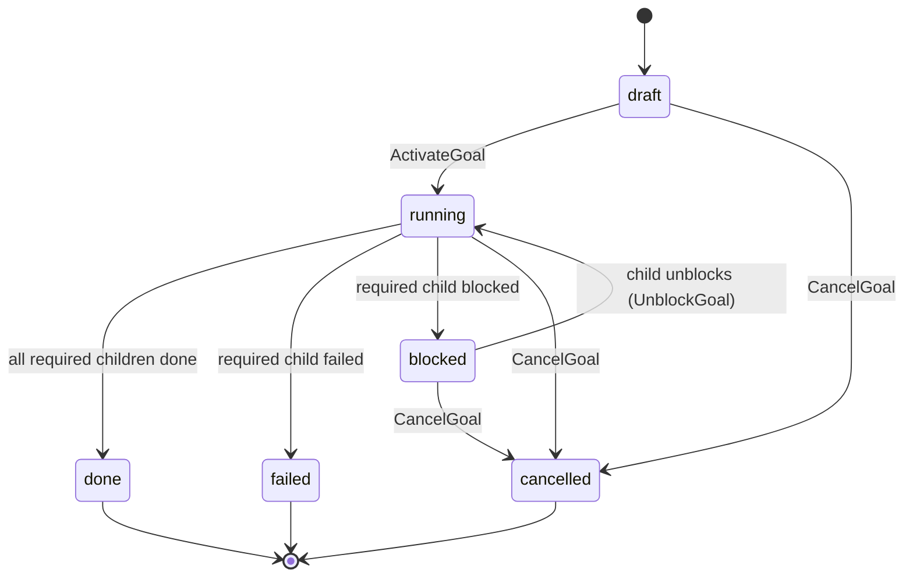

The supported goal system is a container layer on top of tasks. A **goal** owns child tasks and rolls up its status from those tasks.

It is not an automatic planning system yet. Stella does not currently split a goal into tasks, synthesize a final goal output, or run agent reviewers for goal reviews. Create child tasks explicitly and attach them with `goal_id`.

> Builds on the [Task system](./task-system).

## Current support matrix

| Feature                      | Status                                                    |
| ---------------------------- | --------------------------------------------------------- |
| Create/list/get goals        | Supported.                                                |
| Attach tasks to a goal       | Supported via `agent_task.goal_id`.                       |
| List child tasks             | Supported.                                                |
| Activate goal                | Supported: draft goal → running, draft children → ready.  |
| Rollup from child task state | Supported for `review_policy=none`.                       |
| Cancel goal                  | Supported: cascade-cancels non-terminal children.         |
| Automatic planner            | Not supported. Create child tasks explicitly.             |
| Final synthesizer            | Not supported. Do not rely on goal `review_policy!=none`. |
| Goal agent review            | Not supported.                                            |
| Agent reviewer runs          | Not supported.                                            |

## Mental model

| Concept                  | Purpose                                                                                                                   |
| ------------------------ | ------------------------------------------------------------------------------------------------------------------------- |
| `agent_goal`             | Container for a related set of tasks. Stores status, priority, review policy, context, output, and active review pointer. |
| `agent_task.goal_id`     | Optional link from a task to one goal. Standalone tasks have no goal.                                                     |
| `agent_task_run.goal_id` | Schema support for future goal-targeted planner/synthesizer runs. Dispatcher scan paths are removed in this release.      |
| `agent_review.goal_id`   | Schema support for future goal-parented reviews. API validation gates this off in this release.                           |

## Supported lifecycle

Supported container mode:



Activation promotes draft child tasks to ready in the same transaction. The dispatcher then picks up those tasks through the normal task readiness path.

## Rollup

`internal/tasks/goal_rollup.go` exposes:

```go
RollupGoal(goal, childCounts, hasOpenSynth) GoalNextState
```

For supported `review_policy=none` goals:

| Child state                                  | Verdict                                                                          |
| -------------------------------------------- | -------------------------------------------------------------------------------- |
| Any required child failed                    | Goal → `failed` with reason `required_child_failed`.                             |
| Any required child blocked                   | Goal → `blocked` with reason `required_child_blocked`.                           |
| Any required child pending/running/reviewing | Goal → `running` (no-op for an already-running goal; recovers a `blocked` goal). |
| All required children done                   | Goal → `done`.                                                                   |

A `blocked` goal keeps rolling up, so resolving a child blocker (or waiving its failed dependency) returns the goal to `running` on the next tick via `UnblockGoal` — there is no separate goal-unblock action. The dispatcher skips no-op transitions where the rolled-up target equals the current status.

For `review_policy=auto`, `agent`, or `human`, the API rejects goal creation/activation in this release. Final synthesis and goal review require a future synthesizer runtime.

## Dispatcher behavior

The supported dispatcher goal behavior is rollup only:

1. Task-side dispatcher steps run first: stale-run interruption, dependency failure propagation, worker task dispatch.
2. `rollupGoals` evaluates non-terminal goals.
3. Rollup applies goal complete/fail/block transitions when child task state requires it.

Planner, synthesizer, and agent-reviewer dispatch scan paths are removed rather than left as noop failure paths. Unsupported goal modes are stopped at API validation.

## No automatic task splitting

A goal does not create child tasks by itself. The supported workflow is:

1. Create a goal.
2. Create child tasks with that `goal_id`.
3. Add dependencies between child tasks where order matters.
4. Activate the goal and tasks.
5. Let the normal worker runtime execute child tasks.
6. Let rollup update the goal.

This is deliberate: automatic planning requires a real planner runtime that can return structured tasks and dependencies, not a prompt-only fallback.

## Review policy guidance

For now, use `review_policy=none` on goals.

Task-level reviews still work for supported policies:

- `none`
- `auto`
- `human`

Use human task reviews when child task output needs approval. Goal-level synthesis/review is rejected in this release and should not be presented as available.

## HTTP surface

| Method | Path                                                                              | Purpose                                                                                      |
| ------ | --------------------------------------------------------------------------------- | -------------------------------------------------------------------------------------------- |
| `POST` | `/api/goals`                                                                      | Create a goal. Use `review_policy=none` in the supported runtime.                            |
| `GET`  | `/api/goals`                                                                      | List goals.                                                                                  |
| `GET`  | `/api/goals/{id}`                                                                 | Fetch one goal.                                                                              |
| `POST` | `/api/goals/{id}/activate`                                                        | Draft → running; promotes draft children to ready.                                           |
| `POST` | `/api/goals/{id}/cancel`                                                          | Cascade-cancel non-terminal children.                                                        |
| `GET`  | `/api/goals/{id}/tasks`                                                           | List child tasks.                                                                            |
| `GET`  | `/api/goals/{id}/reviews`                                                         | Schema-supported, but this release gates the goal review runtime off through API validation. |
| `POST` | `/api/goals/{id}/reviews/{reviewID}/approve` (+reject, request-changes, escalate) | Review decision endpoints exist, but this release does not create a new goal review runtime. |

Any change that rejects unsupported goal review policies must be done spec-first.

## Future work

Add these only after the worker runtime is stable:

- Planner runtime that returns structured child tasks and dependencies.
- Synthesizer runtime that produces final goal output from child task outputs.
- Goal-level review policy separate from synthesis policy, if needed.
- Agent reviewer runtime.
- Retry semantics for goal synthesis changes.
