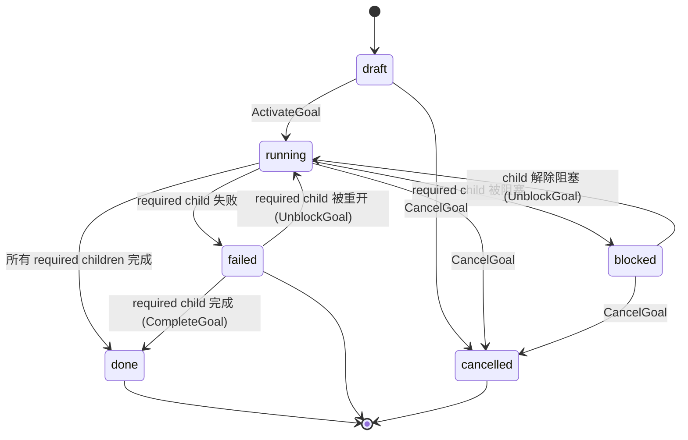

当前支持的 goal system 是 task 之上的容器层。**Goal** 拥有 child tasks，并从这些 tasks 汇总状态。

它现在还不是自动 LLM 规划系统。Stella 当前不会生成 goal 最终综合输出，也不会为 goal review 运行 agent reviewer。Goal 的 child tasks 只能来自**已物化的 plan**（#525）：先编写 plan、接受/批准、再物化——不能手动把 task 挂到 goal 上。

> 构建在[任务系统](./task-system)之上。

## 当前支持矩阵

| 功能                   | 状态                                                 |
| ---------------------- | ---------------------------------------------------- |
| 创建/列出/获取 goals   | 支持。                                               |
| 将 task 挂到 goal      | 支持，通过 `agent_task.goal_id`。                    |
| 列出 child tasks       | 支持。                                               |
| 激活 goal              | 支持：draft goal → running，draft children → ready。 |
| 从 child task 状态汇总 | 支持 `review_policy=none`。                          |
| 取消 goal              | 支持：级联取消非终止 child tasks。                   |
| 自动 planner           | 不支持。请显式创建 child tasks。                     |
| 最终 synthesizer       | 不支持。不要依赖 goal `review_policy!=none`。        |
| Goal agent review      | 不支持。                                             |
| Agent reviewer runs    | 不支持。                                             |

## 心智模型

| 概念                     | 作用                                                                                                                                |
| ------------------------ | ----------------------------------------------------------------------------------------------------------------------------------- |
| `agent_goal`             | 一组相关 tasks 的容器。存储必填 owner agent、可选 project、status、priority、review policy、context、output 和 active review 指针。 |
| `agent_task.goal_id`     | 从 task 到一个 goal 的可选链接。Standalone task 没有 goal。Child task 会继承/校验 goal 的 agent 和 project context。                |
| `agent_task_run.goal_id` | Schema 支持未来 goal-targeted planner/synthesizer runs；本版本删除 dispatcher scan paths。                                          |
| `agent_review.goal_id`   | Schema 支持未来 goal-parented reviews；本版本通过 API validation gate off。                                                         |

## 支持的生命周期

支持的容器模式：



Activation 会在同一个事务中把 draft child tasks 提升到 ready。随后 dispatcher 通过普通 task readiness 路径派发这些 tasks。

## Rollup

`internal/tasks/goal_rollup.go` 暴露：

```go
RollupGoal(goal, childCounts, hasOpenSynth) GoalNextState
```

对支持的 `review_policy=none` goals：

| 子任务状态                               | 结论                                                                                                  |
| ---------------------------------------- | ----------------------------------------------------------------------------------------------------- |
| 任一必需子任务 failed                    | Goal → `failed`，reason 为 `required_child_failed`。                                                  |
| 任一必需子任务 cancelled                 | Goal → `failed`，reason 为 `required_child_cancelled`（cancelled 子任务无法重开，要求永久无法满足）。 |
| 任一必需子任务 blocked                   | Goal → `blocked`，reason 为 `required_child_blocked`。                                                |
| 任一必需子任务 pending/running/reviewing | Goal → `running`（对已 running 的 goal 是 no-op；可让 `blocked` 或 `failed` goal 恢复）。             |
| 所有必需子任务 done                      | Goal → `done`。                                                                                       |

`blocked` 或 `failed` goal 会持续 rollup，因此可以恢复：清除子任务的 blocker，或重开/完成一个失败的必需子任务，会在后续 tick 通过 `UnblockGoal` 让 goal 回到 `running`（当所有必需子任务都已 done 时，则通过 `CompleteGoal` 直接到 `done`）——不需要单独的 goal-unblock 操作。当 rollup 算出的目标状态与当前状态相同时，dispatcher 会跳过这个 no-op transition，因此停留在 failed 的 goal 不会产生抖动。被 cancelled 的必需子任务不会让 goal 恢复：它会重新判定为 `failed`，因为 cancelled 任务无法重开。failed goal 不接受新增 child task——恢复是基于 reopen 的，所以请先重开一个已失败的子任务（让 goal 回到 `running`）再附加新工作。

对 `review_policy=auto`、`agent` 或 `human`，本版本 API 会拒绝 goal 创建/激活。最终 synthesis 和 goal review 需要未来的 synthesizer runtime。

## Dispatcher 行为

当前支持的 dispatcher goal 行为只有 rollup。单个 tick 内：

1. 先运行 stale-run interruption 与 dependency failure propagation。
2. `rollupGoals` 评估活跃或可恢复的 goals（除 `done`/`cancelled` 外的全部），并在 child task 状态要求时应用 goal complete/fail/block/unblock transitions。
3. 最后运行 worker task dispatch，因此第 2 步中恢复到 `running` 的 goal，其新就绪的子任务会在同一个 tick 内被派发。

Planner、synthesizer 和 agent-reviewer dispatch scan paths 已删除，不再保留为 noop failure paths。Unsupported goal modes 通过 API validation 拦截。

## Child tasks 只能来自已物化的 plan

Goal 不会自己创建 child tasks，也不能手动把 task 挂到 goal 上（`POST /api/tasks` 带
`goal_id` 会被拒绝）。支持的流程是：

1. 创建 goal。`plan_mode=direct`（默认）自动 seed、接受并物化一个单任务 plan；
   `plan_mode=deferred` 留在 `draft` 走第 2 步。
2. `PUT /api/goals/{id}/plan` —— 暂存结构化 `PlanContent`（items 带 `role`
   design/impl/verify、`deps`、`criteria`）。
3. 接受它：`plan/accept`（`review_policy=none`），或 `plan/submit-review` 后做一次
   plan-review approve（`review_policy=human`）。
4. `plan/materialize` —— 把 plan 调和为 child task 图；goal → `planned`。
5. 激活 goal；worker runtime 执行 child tasks，rollup 更新 goal。

这是刻意选择：工作始终可追溯到一个已接受的 plan。自动 LLM 规划（从 prompt 返回结构化
items）仍需 planner runtime，尚未接入——plan 内容由你编写。

**`direct`（默认）到底做了什么。** direct goal **不是**"不走 plan"的捷径——它依然拥有一个真实的
`agent_goal_plan` 行。系统在创建 goal 时一步完成：自动编写一个单项 plan（item 标题取自 goal、
`role=direct`）、无 review 直接接受（`review_policy=none`）、并物化它。那个以 goal 命名的单个
child task **就是**这个 plan 的物化产物，不是手动挂上去的 task。只有当你想自己编写多步 plan 时才用
`deferred`。这个 plan 真实存在、可通过 `GET /api/goals/{id}/plan` 读取，Web UI 的 goal 详情页也会在
任务图上方以 **计划** 区块渲染它（每个 item 含 role、依赖和验收标准），因此 direct goal 的单项 plan
同样可见。

## Review policy 建议

当前 goal 使用 `review_policy=none`。

Task-level review 仍然支持这些 policy：

- `none`
- `auto`
- `human`

当 child task 输出需要审批时，请使用 human task review。本版本会拒绝 goal-level synthesis/review；不要把它当作可用能力。

## HTTP surface

| Method   | Path                                                                                   | Purpose                                                                                                                                                                        |
| -------- | -------------------------------------------------------------------------------------- | ------------------------------------------------------------------------------------------------------------------------------------------------------------------------------ |
| `POST`   | `/api/goals`                                                                           | 创建 goal。支持 runtime 中请使用 `review_policy=none`。`plan_mode=direct`（默认）自动规划并物化单个任务；`plan_mode=deferred` 留在 `draft` 供显式规划。                        |
| `GET`    | `/api/goals`                                                                           | 列出 goals。过滤参数：`status`、`terminal`（true=done/failed/cancelled，false=活跃）、`archived=true`（恢复视图）、`q`（标题/描述子串）。响应含 `total` 统计全部匹配用于分页。 |
| `GET`    | `/api/goals/{id}`                                                                      | 获取单个 goal。                                                                                                                                                                |
| `POST`   | `/api/goals/{id}/activate`                                                             | Draft → running；把 draft children 提升到 ready。                                                                                                                              |
| `POST`   | `/api/goals/{id}/cancel`                                                               | 级联取消非终止 children。                                                                                                                                                      |
| `DELETE` | `/api/goals/{id}`                                                                      | 归档终止/draft goal 及其终止/draft children（审计安全，从默认列表隐藏）。                                                                                                      |
| `POST`   | `/api/goals/{id}/unarchive`                                                            | 恢复已归档 goal 及随其归档的 children 回到默认列表。                                                                                                                           |
| `GET`    | `/api/goals/{id}/tasks`                                                                | 列出 child tasks。                                                                                                                                                             |
| `GET`    | `/api/goals/{id}/reviews`                                                              | Schema 支持，但本版本通过 API validation gate off goal review runtime。                                                                                                        |
| `POST`   | `/api/goals/{id}/reviews/{reviewID}/approve`（以及 reject、request-changes、escalate） | Review decision endpoints 存在，但本版本不创建新的 goal review runtime。                                                                                                       |
| `GET`    | `/api/goals/{id}/plan`                                                                 | 获取 goal 的 plan（首次 `PUT` 前返回 404）。                                                                                                                                   |
| `PUT`    | `/api/goals/{id}/plan`                                                                 | 创建或替换 pending plan edit（`content` + `review_policy` none\|human）。plan 处于 in_review 时拒绝。                                                                          |
| `POST`   | `/api/goals/{id}/plan/accept`                                                          | 无评审接受 pending plan（`review_policy=none`）。不提升——由 materialize 提升。                                                                                                 |
| `POST`   | `/api/goals/{id}/plan/submit-review`                                                   | 开启人工 plan 评审（`review_policy=human`）；返回 `subject='plan'` 的 review。                                                                                                 |
| `POST`   | `/api/goals/{id}/plan/reviews/{reviewID}/approve`（以及 reject、request-changes）      | 决定 plan 评审。专用路径——通用 goal-review API 拒绝 `subject='plan'`。                                                                                                         |
| `POST`   | `/api/goals/{id}/plan/materialize`                                                     | 将 accepted/approved 的 plan 物化为任务图；goal → `planned`。                                                                                                                  |

任何拒绝 unsupported goal review policy 的行为变化都必须 spec-first。

## 归档与恢复

归档是审计安全的软删除：`DELETE /api/goals/{id}` 写入 `archived_at`，把 goal（及其终止/draft children）从默认列表隐藏，但不删除历史。仅允许从终止或 draft 状态归档，且幂等——重复归档已归档 goal 为 no-op。

已归档 goal 是**惰性**的：所有生命周期转换（activate、complete、fail、cancel、block、unblock）以及 dispatcher rollup 扫描都会拒绝或跳过它，因此隐藏的工作绝不会被悄悄复活。需要再操作时请先 unarchive。

`POST /api/goals/{id}/unarchive` 反向归档，只恢复**本次** goal 归档级联隐藏的 children（记录在 `goal_archive` 事件里），用户此前单独归档的 task 保持隐藏。恢复未归档 goal 为 no-op。独立 task 有对称接口：`DELETE /api/tasks/{id}` 归档、`GET /api/tasks?archived=true` 列出、`POST /api/tasks/{id}/unarchive` 恢复。

## 后续工作

只有 worker runtime 稳定后再添加：

- 返回结构化 child tasks 和 dependencies 的 planner runtime。
- 从 child task outputs 生成 goal final output 的 synthesizer runtime。
- 如有必要，将 goal-level review policy 与 synthesis policy 拆开。
- Agent reviewer runtime。
- Goal synthesis changes 的重试语义。
