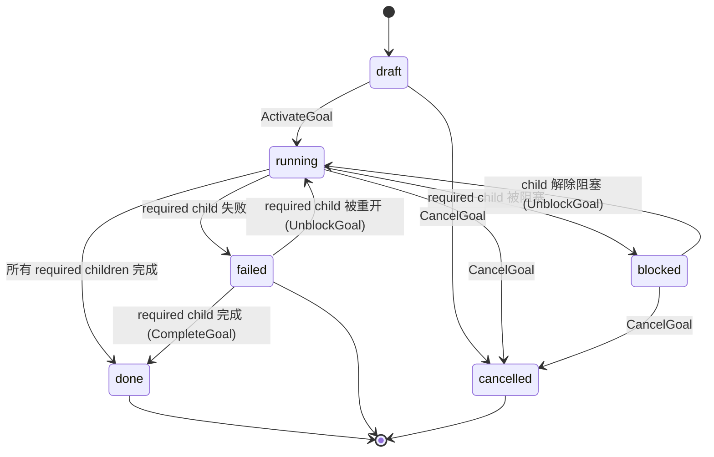

当前支持的 goal system 是 task 之上的容器层。**Goal** 拥有 child tasks，并从这些 tasks 汇总状态。

它现在还不是自动规划系统。Stella 当前不会把 goal 自动拆成 tasks，不会生成 goal 最终综合输出，也不会为 goal review 运行 agent reviewer。请显式创建 child tasks，并用 `goal_id` 关联。

> 构建在[任务系统](./task-system)之上。

## 当前支持矩阵

| 功能                   | 状态                                                 |
| ---------------------- | ---------------------------------------------------- |
| 创建/列出/获取 goals   | 支持。                                               |
| 将 task 挂到 goal      | 支持，通过 `agent_task.goal_id`。                    |
| 列出 child tasks       | 支持。                                               |
| 激活 goal              | 支持：draft goal → running，draft children → ready。 |
| 从 child task 状态汇总 | 支持 `review_policy=none`。                          |
| 取消 goal              | 支持：级联取消非终止 child tasks。                   |
| 自动 planner           | 不支持。请显式创建 child tasks。                     |
| 最终 synthesizer       | 不支持。不要依赖 goal `review_policy!=none`。        |
| Goal agent review      | 不支持。                                             |
| Agent reviewer runs    | 不支持。                                             |

## 心智模型

| 概念                     | 作用                                                                                                                                |
| ------------------------ | ----------------------------------------------------------------------------------------------------------------------------------- |
| `agent_goal`             | 一组相关 tasks 的容器。存储必填 owner agent、可选 project、status、priority、review policy、context、output 和 active review 指针。 |
| `agent_task.goal_id`     | 从 task 到一个 goal 的可选链接。Standalone task 没有 goal。Child task 会继承/校验 goal 的 agent 和 project context。                |
| `agent_task_run.goal_id` | Schema 支持未来 goal-targeted planner/synthesizer runs；本版本删除 dispatcher scan paths。                                          |
| `agent_review.goal_id`   | Schema 支持未来 goal-parented reviews；本版本通过 API validation gate off。                                                         |

## 支持的生命周期

支持的容器模式：



Activation 会在同一个事务中把 draft child tasks 提升到 ready。随后 dispatcher 通过普通 task readiness 路径派发这些 tasks。

## Rollup

`internal/tasks/goal_rollup.go` 暴露：

```go
RollupGoal(goal, childCounts, hasOpenSynth) GoalNextState
```

对支持的 `review_policy=none` goals：

| 子任务状态                               | 结论                                                                                                  |
| ---------------------------------------- | ----------------------------------------------------------------------------------------------------- |
| 任一必需子任务 failed                    | Goal → `failed`，reason 为 `required_child_failed`。                                                  |
| 任一必需子任务 cancelled                 | Goal → `failed`，reason 为 `required_child_cancelled`（cancelled 子任务无法重开，要求永久无法满足）。 |
| 任一必需子任务 blocked                   | Goal → `blocked`，reason 为 `required_child_blocked`。                                                |
| 任一必需子任务 pending/running/reviewing | Goal → `running`（对已 running 的 goal 是 no-op；可让 `blocked` 或 `failed` goal 恢复）。             |
| 所有必需子任务 done                      | Goal → `done`。                                                                                       |

`blocked` 或 `failed` goal 会持续 rollup，因此可以恢复：清除子任务的 blocker，或重开/完成一个失败的必需子任务，会在后续 tick 通过 `UnblockGoal` 让 goal 回到 `running`（当所有必需子任务都已 done 时，则通过 `CompleteGoal` 直接到 `done`）——不需要单独的 goal-unblock 操作。当 rollup 算出的目标状态与当前状态相同时，dispatcher 会跳过这个 no-op transition，因此停留在 failed 的 goal 不会产生抖动。被 cancelled 的必需子任务不会让 goal 恢复：它会重新判定为 `failed`，因为 cancelled 任务无法重开。failed goal 不接受新增 child task——恢复是基于 reopen 的，所以请先重开一个已失败的子任务（让 goal 回到 `running`）再附加新工作。

对 `review_policy=auto`、`agent` 或 `human`，本版本 API 会拒绝 goal 创建/激活。最终 synthesis 和 goal review 需要未来的 synthesizer runtime。

## Dispatcher 行为

当前支持的 dispatcher goal 行为只有 rollup。单个 tick 内：

1. 先运行 stale-run interruption 与 dependency failure propagation。
2. `rollupGoals` 评估活跃或可恢复的 goals（除 `done`/`cancelled` 外的全部），并在 child task 状态要求时应用 goal complete/fail/block/unblock transitions。
3. 最后运行 worker task dispatch，因此第 2 步中恢复到 `running` 的 goal，其新就绪的子任务会在同一个 tick 内被派发。

Planner、synthesizer 和 agent-reviewer dispatch scan paths 已删除，不再保留为 noop failure paths。Unsupported goal modes 通过 API validation 拦截。

## 不自动拆分任务

Goal 不会自己创建 child tasks。支持的流程是：

1. 创建 goal。
2. 用该 `goal_id` 创建 child tasks。
3. 在需要顺序时给 child tasks 添加依赖。
4. 激活 goal 和 tasks。
5. 让普通 worker runtime 执行 child tasks。
6. 让 rollup 更新 goal。

这是刻意选择：自动规划需要真正的 planner runtime，能返回结构化 tasks 和 dependencies，而不是 prompt-only fallback。

## Review policy 建议

当前 goal 使用 `review_policy=none`。

Task-level review 仍然支持这些 policy：

- `none`
- `auto`
- `human`

当 child task 输出需要审批时，请使用 human task review。本版本会拒绝 goal-level synthesis/review；不要把它当作可用能力。

## HTTP surface

| Method | Path                                                                                   | Purpose                                                                  |
| ------ | -------------------------------------------------------------------------------------- | ------------------------------------------------------------------------ |
| `POST` | `/api/goals`                                                                           | 创建 goal。支持 runtime 中请使用 `review_policy=none`。                  |
| `GET`  | `/api/goals`                                                                           | 列出 goals。                                                             |
| `GET`  | `/api/goals/{id}`                                                                      | 获取单个 goal。                                                          |
| `POST` | `/api/goals/{id}/activate`                                                             | Draft → running；把 draft children 提升到 ready。                        |
| `POST` | `/api/goals/{id}/cancel`                                                               | 级联取消非终止 children。                                                |
| `GET`  | `/api/goals/{id}/tasks`                                                                | 列出 child tasks。                                                       |
| `GET`  | `/api/goals/{id}/reviews`                                                              | Schema 支持，但本版本通过 API validation gate off goal review runtime。  |
| `POST` | `/api/goals/{id}/reviews/{reviewID}/approve`（以及 reject、request-changes、escalate） | Review decision endpoints 存在，但本版本不创建新的 goal review runtime。 |

任何拒绝 unsupported goal review policy 的行为变化都必须 spec-first。

## 后续工作

只有 worker runtime 稳定后再添加：

- 返回结构化 child tasks 和 dependencies 的 planner runtime。
- 从 child task outputs 生成 goal final output 的 synthesizer runtime。
- 如有必要，将 goal-level review policy 与 synthesis policy 拆开。
- Agent reviewer runtime。
- Goal synthesis changes 的重试语义。
