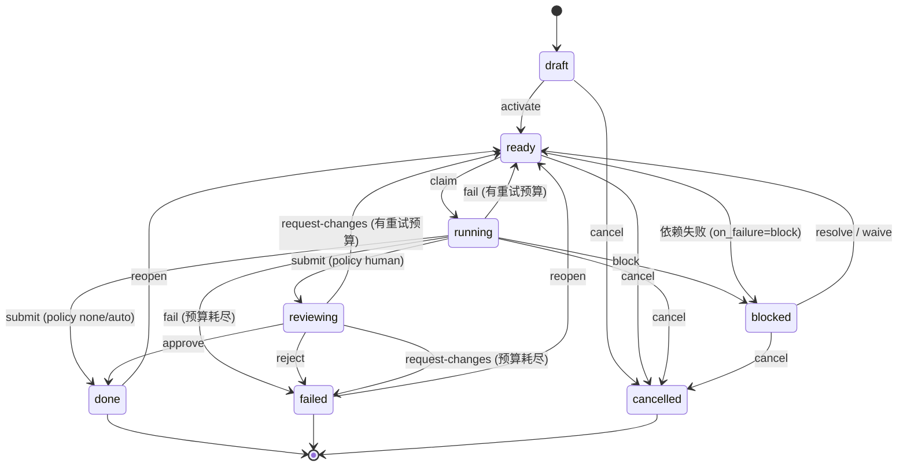

任务系统是 Stella 的持久化执行层，用于处理不应该只存在于一次聊天 turn 里的工作。

本文描述实现契约。面向用户的任务行为见[任务系统概览](/docs/task-system/overview)。

## 当前支持矩阵

| 区域                                      | 状态                                                                    |
| ----------------------------------------- | ----------------------------------------------------------------------- |
| Worker task 执行                          | 支持。Worker run 使用 executor 边界和 `task_control` 终止动作记录。     |
| Task review `none`                        | 支持。Submit 后立即完成 task。                                          |
| Task review `auto`                        | 支持。写入一条自动批准记录用于审计，然后完成。                          |
| Task review `human`                       | 支持，通过 review API 决策。                                            |
| Task review `agent`                       | 无 reviewer runtime；无 API/CLI 可设置。reviewer dispatch scan 已删除。 |
| `review_policy=none` 的 goal 容器         | 支持。Goal 状态从子 tasks 汇总。                                        |
| Goal 自动规划                             | 不支持。必须显式创建 child tasks。                                      |
| Goal 最终综合 / goal review               | 由 API 拒绝。本版本的 goal 使用 `review_policy=none`。                  |
| Planner / synthesizer / reviewer run 执行 | 不支持。对应 dispatcher scan paths 在本版本中删除。                     |

## 持久化模型

持久化状态存储在 SQLite 表中，而不是 runtime 进程内存中。

| 表                         | 作用                                                                                                                                                      |
| -------------------------- | --------------------------------------------------------------------------------------------------------------------------------------------------------- |
| `agent_task`               | 一个可执行工作单元。存储必填 owner agent、必填 worker session、可选 goal/project 关联、业务状态、review policy、context、output、重试计数和 active 指针。 |
| `agent_task_run`           | 一次执行尝试。存储 run kind、attempt number、executor、session、lease、heartbeat、result 和 error。                                                       |
| `agent_task_event`         | 追加式审计日志，记录 transition 和 protocol error。                                                                                                       |
| `agent_task_dep`           | Task 之间的 DAG 边，包括 hard/soft 语义和失败策略。                                                                                                       |
| `agent_task_blocker`       | Task 暂停的原因。每个 task 最多一个 open blocker。                                                                                                        |
| `agent_review`             | Task 和 goal 的 human/auto review 记录。                                                                                                                  |
| `agent_goal`               | 相关 tasks 的容器；支持模式下状态从 children 汇总。                                                                                                       |
| `agent_task_dispatch_hint` | 一次性 hint，告诉 dispatcher 下一次 claim 使用哪个 executor agent。                                                                                       |

Runtime 状态应该很小且短暂。一次 run 期间，worker executor 只记录 Agent 声明的终止动作（`submit`、`block` 或 `fail`）及其 payload。随后 worker 通过 `TransitionService` 应用这个结果。

Migration note：task context-model migration 会把 `agent_task.agent_id` 和 `agent_task.session_id` 变成必填，并给 task session 加唯一索引。包含旧实验 rows（NULL/重复 task session）的数据库需要在应用迁移前 reset 或手动修复；Stella 不提供 runtime backfill。

## 状态权威

`internal/tasks/transition.go` 是持久状态变更的权威。Transition service 之外的代码不应该直接更新 task、run、blocker、review 或 goal 的生命周期列。

典型写入路径：

```text
agent/tool loop
  -> worker executor records terminal result
  -> Worker.applyResult
  -> TransitionService.Submit / Block / Fail
  -> SQL tables + agent_task_event
```

Progress 是例外：task-control progress action 可以在执行期间把 shallow patch 持久化到 `agent_task.context`。Progress 不是终止动作，也不改变 task/run 生命周期状态。

## Task 生命周期



只有支持的 review policy 需要决策时才进入 `reviewing`。`human` review 等待 API/CLI 决策。`auto` 立即决策。`agent` review 当前不是支持的 runtime 路径。

## Readiness，不是 status

`status='ready'` 不等于可派发。可派发性由以下因素计算：

- `not_before` 调度时间。
- hard / soft 依赖状态。
- 依赖失败策略和 waiver。
- active run 约束。
- worker 并发限制。
- executor 解析。

`internal/tasks/readiness.go` 暴露 `Compute(task, deps, now) Readiness`。Dispatcher 在粗粒度 SQL candidate scan 之后使用它。

## 依赖

边可以是 `hard` 或 `soft`。`on_failure` 可以是 `block`、`fail` 或 `ignore`。

| 边类型 | 上游状态               | 失败策略 | 结果                                         |
| ------ | ---------------------- | -------- | -------------------------------------------- |
| hard   | `done`                 | 任意     | satisfied                                    |
| hard   | `failed` / `cancelled` | `ignore` | satisfied                                    |
| hard   | `failed` / `cancelled` | `block`  | 下游进入 `dep_failure` blocker，除非被 waive |
| hard   | `failed` / `cancelled` | `fail`   | 下游 failed                                  |
| soft   | 任意终止状态           | 忽略     | satisfied                                    |
| 任意   | 非终止状态             | 任意     | waiting                                      |

`dep_failure` blocker 不能用通用 blocker resolve 解决，必须 waive 这条依赖边。Waiver 可追责，并存储在依赖边上。

## Dispatcher

`internal/tasks.Dispatcher` 是接入 scheduler 的循环。`cmd/stella` 把它注册成 scheduler service 上的内存 recurring task；它不会创建用户可见的 scheduler job。

Worker 侧 tick 顺序：

1. 中断 lease 过期的 queued/running runs。
2. 把 hard dependency failure 传播到下游 tasks。
3. 从 child task 状态汇总 goals。
4. 扫描 ready task candidates。
5. 计算 readiness。
6. 解析 executor。
7. 创建或复用 task session。
8. Claim task，创建 `agent_task_run` 行。
9. 为该 run 启动 `Worker`。

Planner、synthesizer 和 agent-reviewer scan paths 不属于当前支持的 runtime，并且已删除；不会通过 unsupported events 保护起来。

## Executor 解析

Claim worker task 时，dispatcher 按以下顺序解析 executor：

1. `(task_id, kind='worker')` 的 live dispatch hint。
2. 如果 task 已有 worker runs，使用最新 worker run 的 executor。
3. Task owner/manager Agent（`agent_task.agent_id`）。
4. 写事件并保持 task 未 claim。

系统不能静默选择默认 Agent。无法解析 executor 说明 task 配置错误。

## Session 连续性

每个 task 创建时都会在 `agent_task.session_id` 绑定一个 durable worker session；每个 run 也会在 `agent_task_run.session_id` 记录同一个 session。Dispatcher 不再为正常 task 铸造 worker session —— 创建 task 时就完成。

```text
CreateTask
  -> resolve required agent_id, optional goal_id/project_id
  -> mint task worker session (kind=task, channel=task)
  -> persist agent_task.session_id

Claim
  -> reuse agent_task.session_id for every worker run
```

`agent_task.session_id` 表示 worker session，不表示请求创建 task 的 source chat session。

## Worker executor runtime

Worker 执行围绕 `internal/tasks/executor.go` 中的 `Executor` 接口实现。

关键组件：

- `Executor.Execute(ctx, Request) (Result, error)` 负责一次 claimed run 的 Agent 交互。
- `workerExecutor` 把 run 的 executor agent 解析为 runner factory，并注入 `task_control`。
- `terminalRecorder` 只记录第一个终止动作。
- `recordingControlTool` 是 Agent 看到的 `task_control` 工具。
- `Worker.applyResult` 通过 `TransitionService` 应用单个终止结果。

终止动作：

| Action     | Runtime 行为                                                       | 持久 transition              |
| ---------- | ------------------------------------------------------------------ | ---------------------------- |
| `progress` | 把 shallow patch 持久化到 `agent_task.context`；终止动作前可重复。 | 无生命周期 transition。      |
| `submit`   | 记录 output payload。                                              | `TransitionService.Submit`。 |
| `block`    | 记录 blocker kind/question/detail。                                | `TransitionService.Block`。  |
| `fail`     | 记录 reason/retryable。                                            | `TransitionService.Fail`。   |

Agent-facing tool 不会直接完成、阻塞或失败 task。它声明结果；worker 只应用一次。

## Protocol repair 和 failure

如果第一个 worker turn 结束时没有终止动作，executor 会区分两种情况：

- **Silent exit** -- 没有 assistant 文本，也没有终止动作。Worker 会立刻把它视为 protocol failure。
- **Text-only exit** -- 产生了 assistant 文本，但没有记录终止动作。Executor 会在同一个 task session 中运行一次 repair turn。Repair prompt 会把前一次文本作为上下文，并要求调用一个终止 `task_control` action。

如果 repair turn 记录了 `submit`、`block` 或 `fail`，worker 会正常应用该结果。Runtime 永远不会自动 submit 自由文本。

如果 repair turn 仍然没有终止动作，executor 返回带 `RepairAttempted=true` 的 `TerminalNone`。Worker 随后应用 protocol-error fallback：

- `TransitionService.Fail(... retryable=true)`。
- `agent_task_event` 写入 `event_type='protocol_error'`，并在 `detail.repair_attempted` 中记录是否尝试过 repair。
- 如果还有重试预算，task 回到 `ready`；否则变为 `failed`。

## Heartbeat 和 lease

Active run 带有 `lease_expires_at` 和 `heartbeat_at`。Executor 运行时，worker heartbeat 会延长 lease。如果 Stella 崩溃或 worker 卡住，dispatcher 最终会把 stale run 标为 interrupted，并在重试预算允许时让 task 回到 `ready`。

## API surface

Task routes 扁平挂在 `/api/tasks` 下，并通过认证用户上下文限制作用域。

| Method         | Path                                                 | Purpose                                                                                  |
| -------------- | ---------------------------------------------------- | ---------------------------------------------------------------------------------------- |
| `POST`         | `/api/tasks`                                         | 创建 task。                                                                              |
| `GET`          | `/api/tasks`                                         | 列出 tasks，可按 agent/status/project 过滤。`archived=true` 返回已归档（恢复）视图。     |
| `GET`          | `/api/tasks/{id}`                                    | 获取 task。                                                                              |
| `DELETE`       | `/api/tasks/{id}`                                    | 归档终止/draft task（审计安全软删除，从默认列表隐藏）。幂等。                            |
| `POST`         | `/api/tasks/{id}/unarchive`                          | 恢复已归档 task 回到默认列表。                                                           |
| `POST`         | `/api/tasks/{id}/cancel`                             | 取消 task。                                                                              |
| `POST`         | `/api/tasks/{id}/reopen`                             | 重新打开 done/failed task。已归档 task 会被拒绝——请先 unarchive。                        |
| `GET`          | `/api/tasks/{id}/readiness`                          | 解释可派发性。                                                                           |
| `GET`          | `/api/tasks/{id}/events`                             | 审计事件。                                                                               |
| `GET`          | `/api/tasks/{id}/runs`                               | 执行尝试。                                                                               |
| `GET` / `POST` | `/api/tasks/{id}/deps`                               | 列出/添加依赖边。                                                                        |
| `POST`         | `/api/tasks/{id}/deps/{depTaskID}/waive`             | Waive 失败的 hard dependency。                                                           |
| `POST`         | `/api/tasks/{id}/blockers/{blockerID}/resolve`       | Resolve blocker。                                                                        |
| `GET`          | `/api/tasks/{id}/reviews`                            | 列出 reviews。                                                                           |
| `POST`         | `/api/tasks/{id}/reviews/{reviewID}/approve`         | Approve review。                                                                         |
| `POST`         | `/api/tasks/{id}/reviews/{reviewID}/reject`          | Reject review。                                                                          |
| `POST`         | `/api/tasks/{id}/reviews/{reviewID}/request-changes` | Request changes。                                                                        |
| `POST`         | `/api/tasks/{id}/reviews/{reviewID}/escalate`        | 将 agent review 升级为 human。agent review 不会被自动 dispatch，但已有记录仍可在此解决。 |

任何 HTTP 行为变化都必须走 spec-first：先更新 OpenAPI，重新生成代码，再实现。
